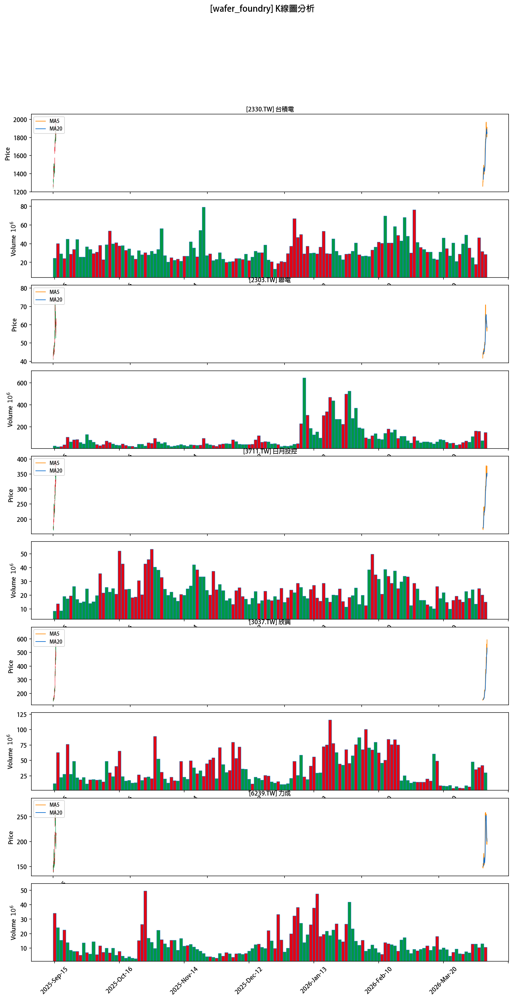
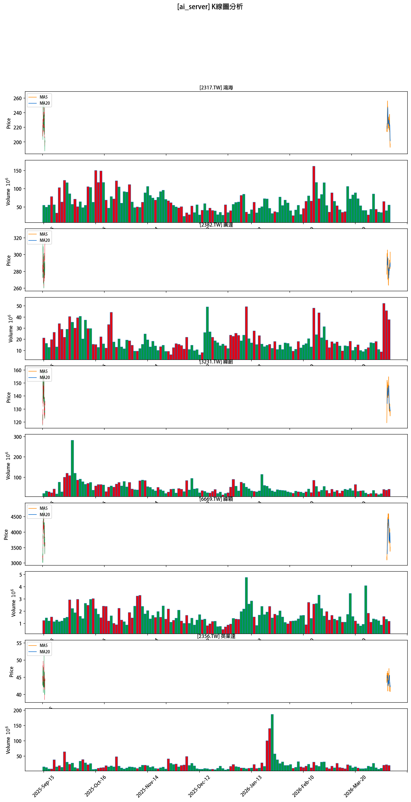
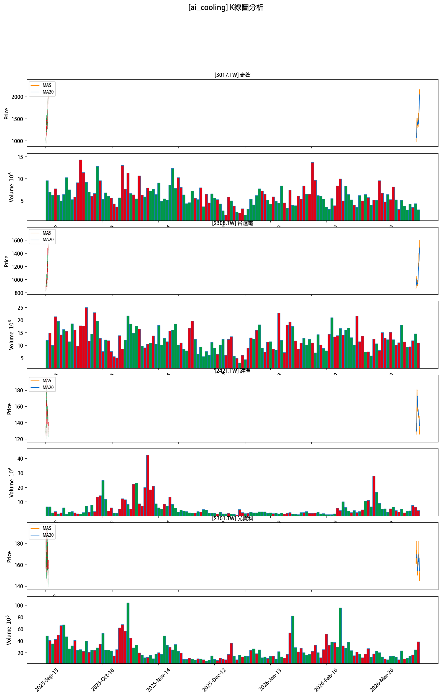

# 台股 AI 與半導體族群趨勢分析系統

一個使用 Vibe Coding 方法論，完全透過 AI 工具協作完成的台股分析專案。

## 專案簡介

本專案旨在分析台灣半導體與 AI 概念股的趨勢，透過 Python 數據處理與視覺化工具，抓取上市股票 OHLCV 數據，繪製 K 線圖並進行技術分析。目標族群分為 3 個子類別，每類最多 5 檔股票。

## 系統環境

- **作業系統**：Windows 10
- **Python 版本**：3.12+
- **主要套件**：
  - `yfinance` - 股票數據抓取
  - `pandas` - 數據處理
  - `numpy` - 數值運算
  - `mplfinance` - K 線圖繪製
  - `matplotlib` - 圖表美化

## 工具鏈清單

- **AI 對話工具**：
  - Claude Sonnet 4.6（開發內容規劃）
  - Gemini 3 Pro（K線解析）
  - minimax m2.5（程式開發）
  - Google Search（股票族群研究）
- **開發工具**：VS Code
- **版本控制**：Git + GitHub

## 資料夾結構

```
taiwan-stock-analysis/
├── src/
│   ├── data_fetcher.py      # 數據抓取模組
│   └── visualizer.py        # K 線圖繪製模組
├── data/                    # 存放抓取的 CSV
├── charts/                  # 存放輸出的 K 線圖 PNG
├── tests/                   # TDD 測試檔案
├── docs/
│   ├── analysis.md          # K 線圖趨勢分析報告
│   └── plans/               # 實現計劃文件
├── requirements.txt
└── README.md
```

## 安裝與執行

```bash
# 1. 安裝依賴
pip install -r requirements.txt

# 2. 抓取數據
python -m src.data_fetcher

# 3. 繪製 K 線圖
python -m src.visualizer

# 4. 執行測試
pytest tests/
```

## 股票族群清單

### 族群一：晶圓代工與先進封裝

| 股票代號 | 股票名稱 | 入選理由 |
|---------|---------|---------|
| 2330.TW | 台積電 | 全球晶圓代工龍頭，先進製程與 CoWoS 封裝領先 |
| 2303.TW | 聯電 | 台灣第二大晶圓代工，成熟製程具優勢 |
| 3711.TW | 日月光投控 | 全球最大半導體封測代工，FOPLP 先進封裝佈局 |
| 3037.TW | 欣興 | ABF 載板龍頭，先進封裝關鍵供應商 |
| 6239.TW | 力成 | 記憶體及高階邏輯晶片封測領導廠商 |

### 族群二：AI 伺服器與 ODM 代工

| 股票代號 | 股票名稱 | 入選理由 |
|---------|---------|---------|
| 2317.TW | 鴻海 | 全球代工霸主，GPU 模組到整機櫃一條龍整合 |
| 2382.TW | 廣達 | 全球 AI 伺服器領先，與微軟、Google 深度合作 |
| 3231.TW | 緯創 | NVIDIA GPU 基板主要供應商，機櫃整合技術高 |
| 6669.TW | 緯穎 | 專注雲端 CSP 客戶，AI 伺服器高規指標廠 |
| 2356.TW | 英業達 | 伺服器 L6 主機板製造優勢，積極擴充整機組裝 |

### 族群三：AI 散熱與電源管理

| 股票代號 | 股票名稱 | 入選理由 |
|---------|---------|---------|
| 3017.TW | 奇鋐 | 全球散熱大廠，液冷板與散熱模組佈局深厚 |
| 3324.TW | 雙鴻 | 伺服器散熱模組大廠，高階液冷解決方案領先 |
| 2308.TW | 台達電 | 電源管理系統龍頭，高效能電源解決方案 |
| 2421.TW | 建準 | 散熱風扇與液冷零件供應商 |
| 2301.TW | 光寶科 | 伺服器電源供應器與儲能解決方案 |

## AI 工具鏈任務對照表

| Phase | 任務描述 | 使用 AI 工具 | 輸入 | 輸出 |
|-------|---------|------------|------|------|
| 0 | 專案初始化與環境建立 | minimax m2.5 | 藍圖文件 | 資料夾結構、requirements.txt |
| 1 | 股票族群研究與分類 | Google Search | 分類 Prompt | 股票清單與入選理由 |
| 2 | 台股 OHLCV 數據抓取 | minimax m2.5 | data_fetcher Prompt | 3 個族群 CSV |
| 3 | K 線圖繪製 | minimax m2.5 | visualizer Prompt | 3 張族群 K 線圖 PNG |
| 4 | 圖表趨勢分析 | Gemini 3 Pro | K 線圖 + 分析 Prompt | analysis.md |
| 5 | README 與文件化 | Claude Sonnet 4.6 | 整份藍圖文件 | README.md |

## Prompt 範例精選

### Phase 2: 數據抓取 Prompt

```
任務：實作 src/data_fetcher.py

規格：
- 使用 yfinance 抓取股票歷史數據
- 時間範圍：今天往回推 180 天
- 必備欄位：Date, Stock_ID, Open, High, Low, Close, Volume
- 輸出格式：長表（每一列是一檔股票一天的數據）
- 每個族群存成獨立 CSV 到 data/ 資料夾
- 實作 try-except，失敗時印出警告繼續執行（不崩潰）
- 網路錯誤自動 retry，最多 3 次
- 每次 API 請求後 sleep 1.5 秒
```

### Phase 3: K 線圖 Prompt

```
任務：實作 src/visualizer.py

規格：
- 讀取 data/ 資料夾內的 3 個 CSV
- 每張大圖用 subplot 垂直排列該族群所有股票的 K 線圖
- 使用 mplfinance 繪製
- K 線顏色：上漲紅色、下跌綠色（台灣習慣）
- 每個 subplot 疊加 MA5（橘色）、MA20（藍色）
- 每個 subplot 下方附成交量副圖
```

### Phase 4: 趨勢分析 Prompt

```
你現在是一位台股技術分析師。

我提供你一張 K 線圖，這是台灣[族群名稱]族群的走勢圖，
包含 MA5、MA20 均線與成交量副圖，時間範圍為近 6 個月。

請依照以下格式分析：

## [族群名稱] 趨勢分析
### 整體趨勢
### 均線訊號
### 量價關係
### 族群內個股強弱
### 結論
```

## K 線圖展示







## 趨勢分析結論摘要

### 族群一：晶圓代工與先進封裝
**結論**：該族群正處於極強動能的噴發階段，操作上應順勢偏多，惟須留意短線乖離率過大後的技術性修正風險。

### 族群二：AI 伺服器與 ODM 代工
**結論**：目前族群處於多頭漲多後的「高檔修正期」，建議觀望並等待股價重回五日線且 MA5 翻揚再行佈局。

### 族群三：AI 散熱與電源管理
**結論**：族群漲多過熱後進入劇烈修正期，建議嚴守 MA20 支撐，未見止跌訊號前不宜過早進場抄底。

## Vibe Coding 心得

### 遇到的挑戰

1. **字體顯示問題**：mplfinance 在 Windows 環境下繁體中文顯示為方塊，需要設定中文字體
2. **資料完整性**：部分股票（如 3324.TW 雙鴻）無法透過 yfinance 抓取數據，需有 fallback 機制
3. **API 限流**：yfinance 有請求頻率限制，需要加入 sleep 機制避免被封鎖

### 流程反思

1. **優點**：
   - 使用 Superpowers 技能系統確保遵循最佳實踐
   - TDD 驅動開發減少後期 bug
   - 明確的 Phase 划分便於追蹤進度

2. **改進方向**：
   - Phase 1 股票清單應在專案開始前確認
   - 數據抓取可加入更詳細的錯誤日誌
   - K 線圖樣式可更統一（如固定尺寸）

---

> 本專案僅供技術研究與學習用途，不構成投資建議。